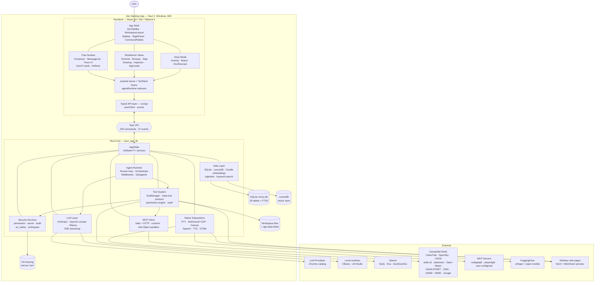
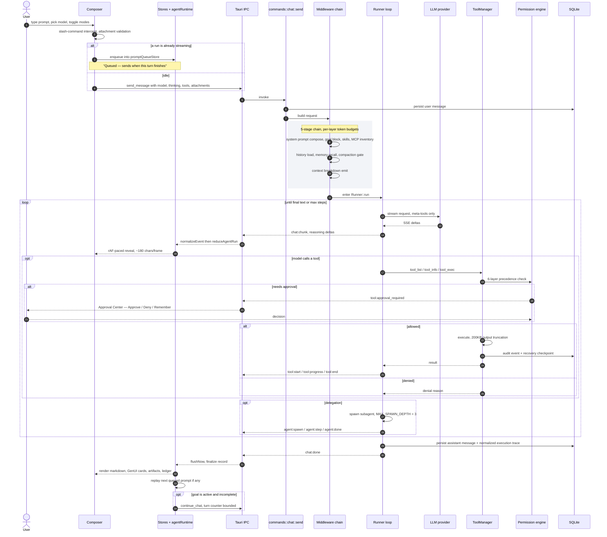

# Zen — Feature Inventory, Tech Stack & Architecture Diagrams

Generated 2026-08-18 from a full read-only scan of the repository (8 parallel subagent sweeps covering
`src-tauri/src/**`, `src/**`, `docs/**`, `.github/**`, `scripts/**`, `test/**`, and all config).

Everything below is split into **Available** (reachable by a user in the shipped build) and
**Implemented but not reachable** (code exists and often has tests, but no command, no registration,
or a feature flag hides it). That split matters here: Zen carries an unusually large amount of the
second kind.

---

## 0. What Zen is

**Authoritative positioning** — [README.md](README.md) (updated 2026-08-13):

> "Zen is a **local-first desktop agentic workbench for research, coding, and workspace automation**.
> It combines a dense chat workspace with permission-aware tool execution, inspectable agent traces,
> document tools, artifacts, and optional OpenUI/GenUI surfaces."
>
> "**Maturity:** Zen is an active prototype/preview platform."

`src-tauri/Cargo.toml` describes the package as *"Zen - Integrated OSINT & Agentic Workbench"*.

**Three competing identities exist in the repo** — worth knowing before reading any doc:

| Doc | Claims Zen is | Status |
|---|---|---|
| [README.md](README.md) | Local-first agentic workbench for research/coding/automation | Current, authoritative |
| [CLAUDE.md](CLAUDE.md) | "High-fidelity OSINT data analysis platform" | Stale (2026-07-01) |
| [WorldView.md](WorldView.md) | "Agentic Spatial Intelligence and Real-Time OSINT Platform", "God Mode" GEOINT | Research essay (2026-05-26), not a spec |
| [IDEA.md](IDEA.md) | A **separate Android companion app** (Kotlin/Compose, Tailscale-tethered) | Brainstorm, not built |
| [specs/](specs/) | Legacy planning artifacts | Explicitly deprecated by AGENTS.md — "do not read it" |

**Release status:** version `0.1.0` in both `package.json` and `src-tauri/tauri.conf.json`.
Windows-only, **MSI-only** bundle. No published release; tag builds require Windows code-signing
secrets that aren't configured yet. **No auto-updater at all** (no `tauri-plugin-updater` dependency;
the release workflow's updater steps are `if: ${{ false }}`; `updateStore.ts` hard-returns
*"Updates are disabled for this build."*).

### Scale

| Metric | Count |
|---|---|
| TypeScript / TSX files | 754 |
| Rust source files | 273 |
| Tauri commands registered in `invoke_handler` | 229 |
| Typed frontend API commands wrapped (`src/api/**`) | ~253 |
| Typed app events (`AppEventPayloadMap`) | 47 |
| `AgentEvent` variants on the Rust bus | 29 |
| SQLite tables | 35 + 1 FTS5 virtual table |
| Feature-registry entries | 35 (12 production / 17 partial / 6 prototype) |
| Node contract tests (`test/verify-*.mjs`) | 192 files, 160 wired to npm scripts |
| Rust `#[test]` / `#[tokio::test]` | 583 in `src-tauri/src` + 12 policy crate + 1 integration |
| Premium GenUI card types | 40 catalog entries + 2 dispatcher-only |
| Theme presets / accent hues | 13 / 7 |

---

## 1. Tech stack

### 1.1 Frontend

| Layer | Technology | Used for |
|---|---|---|
| Framework | **React 19**, TypeScript 5.8, **Vite 8** | App foundation; ~20 manual vendor chunks |
| Styling | **Tailwind CSS 4** (`@theme`, `@custom-variant`, container queries) | One stylesheet: `src/styles/index.css` (1448 lines) |
| Primitives | **Radix UI** (~30 packages) | Dialog, dropdown, popover, select, switch, slider, tooltip, context-menu, collapsible, toggle-group, scroll-area, alert-dialog |
| Icons | **@iconify/react** (`WorkbenchIcon`, 71 importers), **lucide-react** | All iconography |
| State | **zustand 5** (`persist`, `partialize`, `useShallow`) | 18 stores; 4 persisted localStorage keys |
| Data fetching | **@tanstack/react-query** | Chat queries/mutations, 5-min staleTime |
| Motion | **framer-motion** + `MotionConfig` | Single policy in `src/lib/motion.ts` |
| Toasts | **sonner** | Bottom-right, richColors |
| Layout | **react-resizable-panels** | Artifact split view |
| 3D globe | **CesiumJS 1.141** | The operational globe (gated behind "Activate Viewer") |
| 2D map | **maplibre-gl 5** | Renderer written but orphaned; used by voice board |
| 3D | **three** | Welcome black-hole background |
| Editor | **monaco-editor** | Code editor component (orphaned) |
| Terminal | **@xterm/xterm** + `addon-fit` | Live PTY terminals |
| Diagrams | **mermaid 11** | ` ```mermaid ` fences, artifacts, voice board |
| Math | **KaTeX** + remark-math/rehype-katex | Inline + block math |
| Markdown | **react-markdown** + remark-gfm/math/breaks/gemoji/supersub + rehype-slug | Assistant rendering |
| Highlighting | **prismjs** (17 grammars) | Code blocks |
| Charts | **recharts** (lazy) + **chart.js/react-chartjs-2** | ` ```chart ` fences / voice board |
| Generative UI | **@openuidev/react-lang** + `react-ui` | OpenUI Lang DSL runtime |
| STT (browser) | **@moonshine-ai/moonshine-js**, Web Speech API | In-browser transcription |
| Media | **hls.js**, **qrcode**, **topojson-client**, **suncalc** | Camera streams, QR widget, minimap, world-time card |
| Sanitization | **DOMPurify** | All model-authored HTML/SVG |
| Utility | clsx, tailwind-merge, cva, zod, date-fns | — |

**Installed but dead** (no reachable importer): `cmdk` (the palette is hand-rolled),
`vaul`, `embla-carousel-react`, `react-router-dom` (**there is no router — navigation is store-driven**),
`@react-three/fiber`/`drei`, `react-hook-form`, `input-otp`,
`yet-another-react-lightbox`, `@tanstack/react-virtual`, `highlight.js`, `rehype-highlight`,
`rehype-autolink-headings`, and the whole **AI SDK set** (`ai`, `@ai-sdk/anthropic|google|openai|react`) —
zero imports in `src/`; all LLM traffic goes through Rust.

### 1.2 Backend (Rust)

| Layer | Crates |
|---|---|
| Shell | **Tauri 2** (`protocol-asset`, `unstable`), `tauri-plugin-opener`, `tauri-plugin-dialog` |
| Async | tokio (full), tokio-util, async-trait, futures, dashmap 6.1, moka 0.12 |
| HTTP | reqwest 0.12 (native-tls, json, stream, multipart), url, percent-encoding |
| Web server | **axum 0.8** (ws) + tower-http 0.6 (cors) — serves `/ws/gtsm` |
| DB | **sqlx 0.8** (runtime-tokio, sqlite, json) |
| Vectors | **LanceDB 0.26** + arrow-array/arrow-schema 57 |
| Embeddings | **candle 0.9** (core/nn/transformers) + tokenizers 0.21 |
| Tokens | tiktoken-rs 0.6, text-splitter 0.16 |
| Terminal | **portable-pty 0.9** |
| Secrets | **keyring 3** (`windows-native`) |
| Geospatial | **sgp4 0.2** (satellite propagation), **geojson 0.24**, tokio-tungstenite 0.26 |
| Math | **meval 0.2** (expression eval) |
| Extraction | calamine =0.35 (xlsx), quick-xml =0.41, zip 4.6, `pdf-inspector` (git: firecrawl), infer =0.19, scraper 0.22 |
| Audio | **hound 3.5** (WAV), **rodio 0.20** (playback), **cpal 0.15** (devices), **webrtc-vad 0.4** |
| Windows | webview2-com =0.38.2, windows =0.61.3, windows-sys 0.59 (Job Objects) |
| Validation | jsonschema 0.42, similar 2.7, sha2, regex |
| Images | image 0.25, ab_glyph 0.2 |
| Host info | sysinfo 0.38 |
| Logging | tracing + tracing-subscriber + tracing-appender |
| Dev | wiremock 0.6 |

Release profile: `opt-level = "z"`, `lto = true`, `strip = true`, `codegen-units = 1`.
Rust toolchain pinned to **1.97.1**. `spider 2.2` is an unused dependency.

Dependency pins carry provenance comments citing [Security.md](Security.md)'s **≥30-day-old release** rule.

### 1.3 Managed external runtimes (downloaded/bundled, not linked)

| Runtime | Purpose | Delivery |
|---|---|---|
| **whisper.cpp `whisper-server`** | Native STT | Pinned archive via `scripts/runtime-binaries.json` (SHA256-verified); CPU / CUDA / Vulkan variants |
| **Piper** + espeak-ng data + onnxruntime | Native TTS | Same manifest |
| Whisper GGML models | `ggml-{tiny,base,small,medium}.en.bin` | Downloaded from HuggingFace on demand, size-guarded + atomic write |
| Piper ONNX voices | e.g. `en_US-glados-medium`, `en_US-ryan-high`, `en_US-lessac-medium` | HuggingFace `rhasspy/piper-voices` |

### 1.4 Third-party services reached at runtime

**LLM providers** (23-entry `PROVIDER_CATALOG`): OpenAI, Anthropic, Google/Gemini, Groq, Mistral,
DeepSeek, xAI, Qwen, OpenRouter, 9Router, KiloCode, Perplexity, Together, Cohere, AiHubMix, OpenCode,
**Ollama** (local), **LM Studio** (local), + custom OpenAI-compatible endpoints.

**Search:** Tavily, Exa, DuckDuckGo (scraped, spoofed UA).

**Geospatial feeds** (all keyless unless noted): CelesTrak TLE + AMSAT fallback, OpenSky, USGS FDSNWS,
adsb.lol, **aisstream.io** (key), Open-Meteo, NASA EONET v3, submarinecablemap.com, Nominatim/OSM,
OSRM public demo, **HERE Routing v8** (key), **Google Routes v2** (key), ArcGIS/CartoDB tiles,
Google Photorealistic 3D Tiles (key).

**Model/asset hosts:** HuggingFace (whisper + piper models).

---

## 2. Context diagram



---

## 3. Flow diagram — one agentic chat turn, end to end



**Controls available mid-flight:** Stop (`abort_chat`), Pause (`pause_chat`), Resume (`continue_chat`),
per-subagent cancel, per-tool retry, per-tool undo (recovery checkpoint), `/compact`.

---

## 4. Available features

### 4.1 App shell & navigation

- **Custom window chrome** — 44px `ZenTitleBar` with drag region, app-icon-as-sidebar-toggle,
  minimize / maximize / close via `@tauri-apps/api/window`.
- **Two-stage boot** — native `splashscreen.html` → React `BootScreen` handoff on the
  `zen:main-visible` event, cosmetic reveal clamped 3.2–5.0 s, skipped when animations are off.
  7-step init ladder: settings → theme → provider → model → vectorstore → chathistory → updates.
- **Single-layout workspace** — `[sidebar | main | drag-resizer | rightPanel]` + optional status bar.
  Sidebar animates 260↔0 px on desktop, becomes an overlay under 767 px, has a 12 px hover-peek strip.
  Right-panel width persisted (`zen_right_panel_width`, 240 – 60vw).
- **Workspace views** — `welcome`, `chat`, `loading`, with animated transitions.
- **Command palette** (`Ctrl/Cmd+K`) — hand-rolled; Actions + Settings groups; 8 actions:
  New chat, Search sessions, Toggle voice mode, Toggle sidebar, Open approval center,
  Toggle right panel, Theme toggle, About Zen; settings entries generated from the visible-feature registry.
- **Global shortcuts** — `Ctrl/Cmd+K` palette, `Ctrl/Cmd+B` sidebar, `F11` fullscreen,
  `Esc` dismiss, `↑/↓/Enter` palette nav. All guarded against text inputs.
- **Status bar** — clock, calendar, update badge.
- **Error boundary** — "FATAL SYSTEM PANIC" fallback with reload.
- **Universal session search** overlay (min 2 chars, server-side FTS).
- **Right workbench — 10 draggable, closable, persisted tabs**: metrics, inspector, approvals,
  artifacts, attachments, agents, drawing, terminal (multi-instance, PTYs survive tab switches),
  map (explicit "Activate Viewer" GPU gate), browser.

### 4.2 Design system — "UI Atlas"

- **13 theme presets**: OLED Dark, Default Light, Ocean Depth, Rose Garden, Forest Canopy, Warm Earth,
  Cyberpunk, Startup Fresh, Corporate Navy, Minimal Mono, eDEX Cyan, eDEX Amber, eDEX Phosphor
  (+ `system` follows `prefers-color-scheme`). Legacy theme ids auto-migrated.
- **7 accent hues**: Violet, Indigo, Emerald, Rose, Amber, Sky, Slate.
- **4 radius presets**: sharp / smooth / round / pill. **4 style modes**: flat / subtle / bordered / glass.
- **Density**: compact / cozy (`data-density`, persisted).
- **Motion policy** — one file: 4 durations, 2 easings, plus a CSS kill-switch
  (`html[data-motion="off"]` disables every animation and transition).
- **Token system** — semantic colors, spacing scale (`--space-0…12`), semantic spacing, 4 surfaces,
  execution-ledger tokens, display type, fixed Codex palette, layout chrome widths.
- **`exportCSS()`** — copy the current theme out as CSS variables.
- **Design-token guard** (`npm run lint:tokens`) — fails on off-scale arbitrary px in spacing/size
  utilities and on raw 6-digit hex in `.tsx`, with a frozen baseline of ~41 pre-existing files.
- **Container-query-driven composer contract**, execution-row responsive tiers, glass utilities,
  Prism theme, ~11 keyframes.
- **Accessibility**: 297 `aria-label`, 114 `role`, 23 `aria-live`, 23 `sr-only`; centralized
  `.codex-focus:focus-visible` ring; Radix dismiss/roving-focus semantics.

### 4.3 Chat

**Sessions / threads**
- Create, create-in-workspace, rename (inline + auto-titling via a configurable title model),
  delete, bulk delete-all, pin/unpin, archive/unarchive (archived opens read-only),
  export (**JSON only**), import.
- **Folders/groups**: create, rename, delete, move chat in/out. Chat **tags** API exists.
- **Two sidebar display modes** (workspace / timeline), sort by updated or created,
  manual drag-reorder within a workspace, all persisted.
- Sidebar sections: Pinned, Search results, Chat groups, Latest activity, archived toggle.
- Server-side full-text search (`search_chats`) + paginated listing.
- Per-chat workspace binding + workspace context header.

**Turn lifecycle**
- Streaming send with per-turn capability flags: web search, thinking (+effort/budget),
  deep research, generative UI, image generation, tool set, system-prompt mode, voice display context.
- **Stop / Pause / Resume** as three separate live controls; per-subagent cancel.
- **Prompt queue** — submitting mid-stream never aborts; prompts queue per chat, show in a strip
  with remove/send-now, and auto-replay on turn advance. Send button flips to "Queue message".
- **Regenerate** on the latest user turn (older turns are settled history by design).
- **Retry** on failed turns and per failed tool.
- **Undo** — per-tool-call recovery checkpoint ("Recovery checkpoint · N files") with confirm;
  restores only if the file still holds the exact recorded bytes, so external edits fail closed.
  Cap: 256 mutations per chat.
- **`/compact`** manual context compaction with optional focus instructions; refuses mid-stream;
  emits `context:compacted`, keeps the last 10 messages.
- **Context meter** — circular gauge + popover: per-category section breakdown, free headroom,
  iteration, pinned count, soft cap, actual in/out tokens, tokens reclaimed by compaction.
- **Message list windowing** — head 2 / tail 40 with "Show N earlier messages", old turns folded to
  one-line markers, follow-at-end auto-scroll with a 40 px re-arm band.

**Composer**
- **Slash commands**: `/clear`, `/compact`, `/goal` (+ `pause|resume|clear`), `/help`, `/skills`,
  `/settings`, plus every discovered workspace skill as a kebab-case command. Backend-authoritative
  suggestions with keyboard nav.
- **Goal banner** — pinned objective with status active/paused/complete/blocked, turn counter,
  pause/resume/clear; the model can mark complete/blocked via its `update_goal` tool.
- **Attachments** — file picker, drag-and-drop with full-surface overlay, paste, per-file pills.
  Limits **25 MB/file, 20 per chat**; ~40 allowed extensions (text/code/pdf/office/epub/images);
  batched rejection toast with per-file reasons.
- **6 mode toggles** — web search, thinking, deep research, image generation, generative UI
  (+ tool set), all persisted; auto-disabled when the selected model loses the capability.
- **Reasoning config** — effort models get Low/Medium/High; budget models get a 1024–32768 slider;
  native-reasoning models say so explicitly.
- **Permission-mode menu** — 4 modes: **Plan mode** (read-only), **Ask before changes**,
  **Edit automatically**, **Full access / yolo** (explicit confirm dialog; hard security blocks still apply).
- **Model selector** — searchable model+provider dropdown with capability badges.
- **Pinned action bar** — pin search / research / genui / thinking to a persistent rail.
- **Image presets** (when image gen is on) — photorealistic, anime, cyberpunk, 3D render,
  oil painting, minimalist vector.
- **Prompt stash** — bookmark a draft (text + images) in one chat, restore it in another;
  schema-versioned with a ~2.7 MB image budget.
- Auto-resizing textarea with 4 layout modes; mic button; skills-registry entry;
  read-only footer for archived transcripts.

**Message rendering**
- GFM markdown: tables (scrollable Radix tables), strikethrough, autolinks, task lists,
  superscript/subscript, `<details>`, **GitHub alerts** (`[!NOTE] [!TIP] [!IMPORTANT] [!WARNING] [!CAUTION]`).
- **Per-message-scoped footnotes** with back-links.
- **Citations** — bare numeric links become inline citation pills; a trailing `## References`
  section is lifted into a card grid.
- **Code blocks** — Prism with 17 grammars, language label, copy, "open as artifact".
- **Fenced-language routing** — ` ```openui `/` ```genui ` → OpenUI runtime, ` ```mermaid ` → Mermaid
  (with backend `repair_mermaid` self-heal), ` ```chart ` → Recharts (with `repair_chart`),
  ` ```tree ` → FileTree.
- **Math** — KaTeX inline + block.
- **Images** — zoomable `InteractiveImage`, multi-image gallery, export generated image to workspace.
- **Link safety** — every generated href passes `isSafeGeneratedHref`; clicks open the in-app
  browser preview rather than navigating; YouTube links get an inline card.
- **Artifacts panel** — Preview ↔ Code toggle, copy, download, split or embedded; HTML/SVG run in a
  sandboxed iframe; markdown and OpenUI get their own renderers.
- **Reasoning blocks** — collapsible, 3 density presets (compact/balanced/detailed), section splitting,
  markdown + math inside.
- **Streaming polish** — plain-text fast path for short chunks, configurable streaming speed,
  skeletons, per-block memoization, `MarkdownErrorBoundary` so one bad block can't blank a message.

### 4.4 Execution & trace UI

- **Tool call cards / ledger rows** — humanized names, category color stripe
  (edit/run/read/search/delegate/approval/error/generic), live timer + final duration,
  statuses running / completed / error / interrupted / awaiting_approval, retry, cancel, undo,
  redacted input/output preview.
- **Typed tool content renderers** — MCP results, browser actions, images, terminal output,
  search results, artifacts, generic key/value fallback, `TruncatedOutput`.
- **14 per-tool rich renderers** — `get_earthquakes`, `get_military_aircraft`, `calculate_route`,
  `geocode_search`, `reverse_geocode`, `get_system_metrics`, `calculator`, `write_todos`,
  `list_documents`, `list_directory`, `read_document_content`, `grep_documents`, `search_files`
  (+ nested `tool_exec` unwrapping).
- **Unified diff rendering** with intra-line word-level highlighting.
- **Execution ledger** — one chronological, phase-grouped ledger per assistant turn with a shared
  disclosure state machine (collapsed → summary → expanded); persisted server-side and replayed on reload.
- **Risk badges** — Low / Medium / High / Critical.
- **Approval Center** — queue of pending approvals with risk chip, **Approve / Deny / Remember**,
  technical-details preview capped at 2000 chars with secrets redacted; pending count badges the tab.
- **Subagents** — per-subagent execution cards and horizontal delegation lanes
  (Working / Cancelled / Failed / Complete), bounded live transcript, per-agent cancel.
- **Run Inspector** — 5 views (Summary, Timeline, Tree, Agents, Diagnostics) over the persisted trace,
  with text search, status filter, approval filter, duration formatting, and JSON export
  (240-node render cap, 1000-node export cap).
- **Run status popover** + **workspace execution indicator** — live "what is the agent doing".
- **Timeline scrubber** — draggable + keyboard rail with markers for approval / edit / agent events.
- **Security boundary summary** — per-turn plain-language statement of the sandbox in force:
  workspace lock, terminal approval posture, the permission mode's write scope, connected MCP servers.
- **Task plan preview** — compact plan step list with hidden-step count.
- **Deep research UI** — clarification form (unanswered fields become "Not specified" and answers
  become binding scope), execution-history timeline with progress bar and per-step status dots,
  per-agent cards with sub-question chips, animated loader.

### 4.5 Generative UI

- **Two model-facing syntaxes** — `<card>{...}</card>` JSON spans and ` ```openui `/` ```genui ` fences.
  Both are tokenized so cards interleave inline with prose. Malformed payloads degrade to a visible
  message; mid-stream open tags show "Generating card…".
- **40 premium card types** (with aliases): weather, stock, sports, flight, product, event, movie, book,
  person, nutrition, package, job, metric, record, comparison, status, recipe, link_preview, timeline,
  currency, poll, invoice, map_pin, code_snippet, word_definition, agent_step, translation,
  document_summary, diff, chart, memory_recall, math, citation, terminal, flashcard, world_time
  (+ dispatcher-only `map` and `composer`). Shared `CardShell`, animated `CountUp`, motion boundary,
  reduced-motion respected. `ChartCard` is lazy-loaded. Unknown types get a summary-first fallback
  with collapsible JSON — no dead ends.
- **OpenUI Lang runtime** — positional-argument component DSL ending in a single `root =` assignment;
  Preview ↔ CODE toggle; inline error list instead of a crash; 17-point rendering contract enforced by
  prompt; **display-only — no tools, no network, no eval, no event handlers**.
- **Sandboxed iframe** — all model-authored HTML/SVG renders via `srcdoc` under
  `default-src 'none'; img-src data: blob: https:; style-src 'unsafe-inline'; font-src data:; base-uri 'none'; form-action 'none'`
  after DOMPurify.

### 4.6 Voice mode

- **Overlay** with 5 states (initializing, listening, processing, speaking, idle) and an exit
  confirmation offering "Leave voice" vs "Stop everything".
- **Oscilloscope** — live `AnalyserNode` waveform + mic amplitude + TTS playback-energy meters.
- **Subtitles** — captions toggle, speaker attribution (user/agent/system), streaming partials.
- **Push-to-talk** — hold-to-talk with a 20 s cap, global toggle event, release on
  keyup/blur/visibility/click/limit, space-key suppression, mic gain ducking.
- **Hands-free VAD loop** — configurable threshold, 2 s silence to end an utterance,
  **barge-in** (speaking over the agent stops TTS and aborts the turn).
- **3 STT engines** — Web Speech API, **Moonshine** in-browser (auto-falls back to Web Speech),
  **Whisper** native (model + compute-device choice, backend reported as cuda/vulkan/cpu).
- **2 TTS engines** — Piper (default) or Web Speech, with voice selection, rate, pitch.
- **Voice board** — the agent pushes widgets onto a 4×4 stage grid while talking, with per-widget span,
  focus/expand, zoom, save/cancel. Production widgets: note, metric, table, chart, equation, code,
  image, link-preview, progress, divider, svg, palette, diff. Partial: gen-ui, premium-card, qr, kroki.
  Preview: map, video, camera, html.
- **Diagnostics strip** — uptime, STT engine + backend (color-coded), link status, amp signal %,
  latency from tokens/sec, last 3 log lines, TTFT metrics, memory.
- **Agent activity mirroring** — the overlay shows the running tool and mirrors chat streaming;
  `voiceDisplayContext` tells the model it is speaking and what is on the board.

### 4.7 Agent runtime & tools (backend)

- **Runner loop** with bounded steps, tool batching, reasoning/text ordering contract
  (`reasoning → tool batch → text → next tool batch → reasoning → final text`).
- **Three-layer tool registry** (progressive / v1 / v2) unified by `ToolManager`.
- **Meta-tool protocol** — only `tool_list` / `tool_info` / `tool_exec` schemas are injected per turn;
  20 discoverable core tools behind them. Keeps prompt token cost flat as the catalog grows.
- **5-stage middleware chain** with per-layer token budgets: system prompt composition, history +
  memory recall, compaction gate, context breakdown emission.
- **Permission engine** — 6-layer precedence, 4 modes, secret redaction; a **critical floor**
  (`run_command`, `terminal`, `format`, `delete_file`) that is never auto-allowed even in yolo mode.
- **Per-call audit** to SQLite for 13 privileged operation kinds.
- **200 KB tool-output truncation** + concurrency semaphore.
- **Subagent delegation** — `MAX_SPAWN_DEPTH = 3`, per-agent cancel, scoped stream isolation.
- **Orchestrator** — LLM task planner (`resources/prompts/orchestrator_planning.txt`) producing 3–7
  tasks with agent assignment, priority, dependencies, complexity 1–10.
- **4 built-in agents** — `generalist`, `researcher`, `operational_expert`, `voice_display`;
  plus user-defined agent profiles.
- **Skills system** — agentskills.io `SKILL.md` folder-per-skill, workspace discovery, slash exposure.
- **Deep research** engine with clarification round and parallel researchers.
- **Recovery checkpoints** for file-mutating tools.

### 4.8 LLM layer

- **23-entry provider catalog** + custom OpenAI-compatible endpoints.
- **SSE streaming** with reasoning shaping and outbound message sanitization.
- Model catalog refresh + capability profiles (reasoning kind, image gen, context window).
- Local providers: **Ollama** and **LM Studio** (with context-window detection).
- Prompt caching, hardware-acceleration flag, per-provider parameter config.
- Usage/cost aggregation per provider and model.

### 4.9 MCP (Model Context Protocol)

- **Dual-scope config** — user `~/.config/zen/mcp.json` + workspace `.mcp.json`;
  workspace overrides user on name collision; workspace resolution fails closed.
- **Transports** — stdio and HTTP; stdio children confined by **Windows Job Objects**;
  remote requires explicit opt-in; bearer tokens refused over plaintext.
- **Human-in-the-loop consent** — SHA-256 fingerprint of connection-relevant config, un-grandfathered
  (empty consent file ⇒ every server needs approval); header/env *values* never hashed.
- **Protocol versions** — 2026-07-28 (modern), 2025-06-18 (legacy), 2024-11-05 (compat).
- **Tools** exposed as first-class `Tool` objects via `mcp_adapter` (no `ext:server:name` re-parsing).
- **Resources & prompts browser** (read-only): listResources, readResource, listPrompts, getPrompt.
- **Elicitation** — modal form renderer with FIFO queue and replay-on-mount.
- **Discovery/inventory** for agent + settings + diagnostics; reports config and connection state only —
  never commands, headers, env, or credentials. Caps: 32 servers, 8000 prompt chars.
- **Secrets interpolation** in env: `${env:VAR}` and `${secret:NAME}`.
- Repo ships two servers in `.mcp.json`: `codegraph` and `playwright`.

### 4.10 Data, documents & retrieval

- **SQLite** (`novus.db`) — 35 tables + FTS5, migrations on boot, WAL sidecars managed by cleanup.
- **Document ingestion** — format dispatch for txt/md/csv/json/html/xml/yaml/toml/source code,
  **PDF** (`pdf-inspector`), **xlsx** (calamine), **docx/pptx** (zip + quick-xml), epub;
  chunking via `text-splitter`, embeddings via **Candle**, vectors written to **LanceDB**.
- **Per-chat attachments** — blobs under `<app_data>/attachments/<chat_id>/` with extracted-text
  sidecars, SHA-256 content hash for integrity/dupe detection. Caps 25 MB / 20 per chat.
- **Retrieval today is keyword/FTS-based** (see §5 — the vector index is written but never searched).
- **Web search** — Tavily, Exa, DuckDuckGo with provider priority, depth, max results.
- **Web fetch** — SSRF-hardened: DNS resolved once, every returned IP validated, socket pinned to the
  validated address so the hostname cannot re-resolve; 5 redirects max, 1 MiB response cap,
  16 KiB output cap, 10 s timeout; blocks private/loopback/link-local/ULA/multicast and the exact
  cloud-metadata address `169.254.169.254`; unwraps IPv4-mapped IPv6 before applying rules.
- **Conversation memory** — session memory with max turns, history summarization (configurable model),
  semantic recall with a drift threshold, max recalled messages, memory stats + clear.
- **Backup** — portable export / inspect / import with a summary; Replace mode deliberately blocked.
- **Data cleanup** — "Reset Zen data" inventory + purge across `novus.db`(+`-wal/-shm/-journal`),
  `lancedb`, and other app-data categories, with restart-required signalling.
- **Backend logging** — daily-rolling `zen-backend.log` with 14-day retention.

### 4.11 Terminal

- **PTY sessions** via `portable-pty`; PowerShell (`-NoLogo -NoProfile`) on Windows, `$SHELL` elsewhere.
- **xterm.js panel** — multi-session list, session view with fit addon, status footer,
  line formatting; PTYs survive tab switches because the layer stays mounted.
- **Approval-gated spawn** — a UUID approval with 60 s TTL, bound to cwd + chat; every failure writes
  a `ShellCommand` / `Deny` audit event. Per-chat ownership on write/kill/resize/read.
- **Workspace confinement** — cwd resolved through `resolve_workspace_path`, else "Workspace violation".
- **Tree-kill** — `taskkill /F /T /PID` so compiler/server descendants can't outlive a closed tab.
- **64 KiB per-session output buffer** with UTF-8-safe trimming (no panic on multibyte glyphs).
- **One-shot command execution** with timeout + cancellation, partial output preserved,
  LLM formatting that keeps the last 16 KB with a truncation banner.
- Console actions in the telemetry drawer: word-wrap, scroll lock, export log history, clear buffer,
  click-to-load command history.

### 4.12 Browser preview

- **Real child WebView2** attached over a transparent React placeholder via Tauri's unstable
  `add_child` — not a sandboxed iframe. Isolated `data_directory`, **granted no Tauri command
  capabilities**. One stable label so the webview is reused across navigations.
- **Navigation UI** — back/forward history, reload, address bar, viewport presets,
  open-in-external-browser, home placeholder.
- **Console capture** — injected page hook overriding `console.*` plus `error`/`unhandledrejection`,
  posting over `window.chrome.webview.postMessage`; 4096-char message cap enforced on both sides;
  500-entry ring buffer; surfaced in a console drawer with Clear.
- **CDP via in-process COM** (`CallDevToolsProtocolMethod`) — deliberately **not**
  `--remote-debugging-port`, so no local socket is opened.
- **URL security policy** — Rust port of the frontend guard; rejects credentials in URLs,
  blocks private/loopback/link-local/multicast/CGNAT/TEST-NET, handles numeric short-form bypasses
  (`http://127`, `http://0x7f.1`, `http://2130706433`); loopback is opt-in for user-typed URLs only.
- Screenshots write to `<data_dir>/screenshots/` and return `asset://localhost/...` (never inline base64).

### 4.13 Canvas, drawing & math

- **Interactive drawing canvas** in the right panel — tools, styles, live draft preview,
  undo/redo (50 deep).
- **TOON notation** — the compact draw-command language the model writes: 15 commands
  (`s` style, `bg`, `l` line, `r` rect, `c` circle, `e` ellipse, `p` polygon, `f` freehand path,
  `tx` text, `ar` arrow, `tr` triangle, `st` star, `er` eraser, `cl` clear), a 14-name color
  vocabulary plus `#RGB`/`#RRGGBB`/`#RRGGBBAA`, and line-numbered parse errors.
- **Canvas summary for the model** — object list with bboxes, filtered by `llm` vs `user` source.
- **Anchors** — `canvas.center`, `circle1.bottom` etc.; 13 canvas anchor points, 9 object anchor
  points, offset support, anchor-to-absolute compilation.
- **Geometry helpers** injected into the prompt — `find_free_space` quadrant search,
  `objects_in_region`, `next_position`, `snap_to_grid`, `align_relative`, distance, intersection.
- **Semantic planning phase** — the model can emit a `DrawingPlan` with placement hints
  (9 semantic positions, 4 relative prefixes, 4 size tokens) that is validated before drawing.
- **Layout validation + auto-fix** — issue codes `out_of_bounds` (error), `overlap` (warning),
  `center_crowded` (info); auto-fix clamps to a 10 px inset and shifts overlaps.
- **Mathematical plotting** — 4 plot types (function, parametric, polar, inequality) via `meval`,
  unicode normalization (π, θ, ×, ÷, ≤, ≥, ≠), discontinuity "pen lift" detection,
  Douglas-Peucker path simplification, and an expression-safety allowlist.
- **Graph sessions with git-like history** — 15 `SessionAction` variants, every mutating action
  snapshots and commits, `rollback_to_version` restores and truncates future history;
  limits 20 expressions / 15 variables / 50 commits / 50 annotations; neon 8-color palette;
  piecewise `{cond: expr}` syntax; per-expression plot cache; validation for `undefined_variable`,
  `division_by_zero`, `circular_dependency`; vision-capture export for the model.

### 4.14 Geospatial workbench (GTSM)

> **Off by default.** Three DB gates: `gtsm_api_enabled` must be explicitly `"true"`,
> `gtsm_paused` defaults to paused, `gtsm_adsb_enabled` defaults off. The map tab additionally
> requires an explicit "Activate Viewer" click before Cesium initializes.

- **3D Cesium globe** — 9 custom data sources (flights, earthquakes, vessels, natural events,
  military, connectors, cables, cameras, nuclear), entity stacking/declutter, chunked entity updates,
  color/animatable caches. View modes globe / navigation / radar via camera morphs.
- **Basemaps** — Dark (CartoDB), Satellite (ArcGIS), None, and Google Photorealistic 3D Tiles
  (needs a key; silently falls back).
- **9 data layers with live counts + loading/error state** — satellites, flights, earthquakes,
  military aircraft, vessels, natural events, weather, undersea cables, camera catalog.
- **Feeds** — CelesTrak TLE with AMSAT fallback and **sgp4** propagation (batched 250 at a time,
  6 h refresh), OpenSky (100 flights), USGS earthquakes, adsb.lol military, **aisstream.io** AIS over
  WebSocket (5 regional bboxes, 5 s batch flush, 10 000-vessel cap, 30 s ping, 15 s reconnect,
  17 ship-type classes), Open-Meteo point + grid (200-point cap, ~28 WMO codes),
  NASA EONET (12 category mappings), submarinecablemap GeoJSON (12 MiB cap).
- **Streaming** — axum WebSocket at `/ws/gtsm` with an initial cached snapshot then broadcasts;
  poll intervals 30 s military / 120 s satellites / 300 s flights+quakes+snapshot / 900 s EONET /
  3600 s cleanup.
- **Visual overlays** — orbital path (72-segment glow polyline) and sensor footprint (350 km cone)
  for a selected satellite; clustering for flights + vessels + military; temperature-colored weather grid;
  hub/child label collapse with connector polylines; primary-target camera lock.
- **HUD & panels** — Viewport HUD (lat/lon/alt/resolution + camera lock), unified search
  (geocoded places + live entities with fuzzy scoring + recent-query history),
  Map Settings panel (Layers / Sources / Imports tabs with per-connector provider, refresh interval,
  status, attribution, error detail), Camera Catalog panel, Favorites panel, FPS badge,
  Target Inspector (per-type readouts, datalink sparkline from telemetry history, raw metadata grid,
  **"Analyze target"** LLM synthesis), Minimap (Natural Earth topojson, graticule, FOV bracket,
  click-to-fly, 30 fps throttled).
- **Timeline replay** — Live ⇄ Replay toggle, play/pause, 1×/2×/10×/100× speeds, drag scrubber over
  the real telemetry range, 1h/6h/24h/48h/7d windows. Backing store: 48-hour telemetry retention
  with paginated history and per-entity tracks.
- **Geofencing (backend + API)** — polygon (ray-casting) and circle (haversine) zones with a stateful
  inside-map so it emits **ENTER/EXIT** transitions rather than repeated hits; alerts broadcast on
  the GTSM socket. Zones are created via command/agent, **not** by drawing on the map.
- **Fusion events** — 3 correlators with distance-based confidence:
  `satellite_over_earthquake`, `military_near_earthquake`, `military_civilian_proximity`.
- **Cameras** — vetted catalog with HTTPS-only validation, `stream_url` omitted from catalog responses
  and resolved only on explicit preview, three sources (built-in demo / local import / configured
  HTTPS+bearer catalog), HLS player, and a local-device-camera preview that never leaves the machine.
  Caps: 512 KB remote / 5 MB local / 250 entries.
- **GeoJSON & KMZ** — drag-drop onto the globe, import modal (name/description/color),
  per-layer panel with feature count, export, delete; GeoJSON/JSON/CSV/KML/KMZ conversion;
  zip-bomb limits (10 MB in, 10 MB KML, 64 entries).
- **Geocoding** — Nominatim search, reverse, and radius-bounded search-near.
- **Routing (backend + API)** — HERE v8 → Google Routes v2 → OSRM fallback chain,
  4 profiles (car/bicycle/pedestrian/truck), traffic-aware where supported,
  Google usage metered into a DB counter.
- **Agent control channel** — the model can drive the map via `agent-map-command`:
  `fly-to`, `select-target`, `toggle-layer`.
- **Render quality controls** — resolution scale, antialiasing (off/FXAA/MSAA), tile detail,
  shadows, globe lighting, FPS badge.
- **Favorites** — saved places bookmarked from the Target Inspector, persisted to SQLite and
  merged over localStorage on rehydrate.

### 4.15 Settings

`SettingsModal` with a grouped sidebar, per-tab lazy loading, pending-change counter, Save/Discard.
**17 visible tabs** across 5 groups:

| Group | Tab | Notable options |
|---|---|---|
| Basics | **General** | Workspace root picker, interface theme, animations, welcome-background quality (SVG/Three.js/Still/Off), compact mode |
| Basics | **Appearance** | 13 theme presets, 7 accents, wallpaper (type, fill, opacity, blur, URL, local pick) |
| Basics | **Workspace** | Workspace root, data directory, sandboxing, max file size |
| AI | **Chat behavior** | Response style, system instructions, auto-titles + title model + title prompt, streaming speed, external tools, reasoning mode/budget/effort, reasoning disclosure density, prompt caching, hardware acceleration |
| AI | **Models & providers** | Provider catalog + custom providers, masked API keys, base URLs, model catalog refresh, connection test, per-provider params, usage panel, LM Studio setup, model library, token settings |
| AI | **Usage** | Discovered models, configured providers, daily token chart, per-model usage, in/out tokens, responses, time range |
| AI | **Agent skills** | Live tool metadata, searchable, grouped by 8 categories, per-tool risk badge, per-tool allow/deny, max reasoning steps |
| AI | **Research & knowledge** | Enable RAG, strict grounding, show citations, search strategy, top-K, web-search provider priority + Tavily/Exa keys + depth + max results, embedding model + chunk size + overlap, session memory + max turns + summarization model + semantic recall + drift threshold |
| AI | **Deep Research** | Research model, depth/rounds, parallel researchers, sources per pass, token budget |
| AI | **Agents** | User subagent CRUD (name, description, model, context tokens, max messages, system prompt, tool allowlist, timeout, max turns, nested delegation, multi-agent mode, visibility, load workspace AGENTS.md) + read-only built-ins |
| Audio | **Voice** | STT engine (Web Speech / Moonshine / Whisper), Whisper model, compute device, capability matrix; TTS engine, browser voice, rate, pitch, output format, speak activation; provider test |
| Audio | **Audio** | Mic device, input gain, capture profile, echo cancellation, noise suppression, AGC, VAD + sensitivity; output device, master/speaker/auditory volume, mute all, haptics, harmonic pitch, system sounds, feedback intensity |
| Safety | **Permissions & tools** | 4 safety modes, per-tool override (mode / always ask / always allow / block), tools grouped by category |
| Safety | **MCP servers** | Server list + live status, add/edit form (transport, URL or command+args, timeout, env JSON with `${env:}`/`${secret:}`, bulk JSON paste), secret fields, resources/prompts browser, consent dialog, reconnect-all |
| Advanced | **Performance & maintenance** | Detected CPU/RAM/GPU, max memory, GPU acceleration, low-resource mode, backup export/inspect/auto-backup, data cleanup with confirm, restart Zen, diagnostics, system info |
| Advanced | **Runtime health** | Ready/Missing/Tracked dependency cards, required badges, install console log |
| Advanced | **Maps** | HERE routing key, Google Maps key, camera catalog HTTPS URL + bearer token + test, documented rejection rules |

**No dedicated tab exists for:** data/privacy or telemetry opt-out, about/licenses, keybindings.

### 4.16 System, diagnostics & security surfaces

- **System Diagnostics panel** — 14 widgets in 3 groups: Clock, Uptime, Sessions / Model, Provider,
  Streaming, Latency, Token usage / CPU+RAM compact, CPU load, RAM pointmap, GPU coprocessor,
  storage volumes, network interfaces.
- **Hardware profile** — sysinfo-based CPU/cores/threads/RAM/OS/hostname/GPU list with VRAM, driver,
  CUDA capability; drives Whisper backend selection.
- **Managed dependency installer** with a live install console.
- **Native confirmation window** (`prompt`, 460×320, always-on-top) for privileged approvals.
- **Audit trail** — 13 privileged operation kinds persisted to SQLite with decision, caller, target, reason.
- **Secrets** — OS keyring only (service `"zen"`), read/write audited, never in localStorage or plain
  SQLite; the UI stores a `__ZEN_SECRET_PRESENT__` sentinel.
- **Frontend sanitization layer** — DOMPurify profiles for HTML and SVG (script/iframe/object/embed/
  link/meta forbidden, `srcdoc` forbidden, no data attrs, no unknown protocols), href allowlist
  confined to `$APPDATA/generated_images` and `media/wallpapers`, and the browser-preview SSRF guard.
- **Feature registry gating** — one predicate (`defaultVisible && maturity !== "prototype" && !labsOnly`)
  drives which settings tabs, right-panel tabs, and workspace modes exist. Labs is compile-time,
  not a user toggle.
- **Browser fallback mode** — when not running under Tauri, `mockClient` answers ~98 of ~253 commands
  from localStorage and `mockStreaming` replays `test/chat-fixtures.json` through the real event
  pipeline, so the agentic UI can be exercised in a plain browser.

---

## 5. Implemented but **not** currently reachable

This is the part that makes "what's available" non-obvious. All of the below is real code — much of it
tested — that a user cannot reach in the shipped build.

### 5.1 Hidden by the feature registry (6 prototype + labsOnly entries)

`settings.commands` (slash-command manager), `settings.hooks` (automation hooks),
`settings.updates`, `settings.skills` (skill registry), `settings.embedding-models`,
`workspace.openui` (Canvas mode — also `requiresSecurityReview`). Two of these render an explicit
`UnderConstructionBanner`; three carry `TODO(config-wireup)` markers for Tauri commands that don't
exist (`check_ollama_status`, `check_lmstudio_status`, `download_embedding_model`, `get_hook_logs`).
`settings.terminal` is `partial` but `defaultVisible: false` because its controls aren't wired to the runtime.

### 5.2 The document vector store is write-only

**`VectorStore::search` is never called and `AppState::rag()` has zero callers.** Documents are
chunked, embedded via Candle, and written to LanceDB — but every retrieval path is keyword/FTS-based.
There is no reranker and no citation module in `rag/`. Related: the embedding dimension is hardcoded
768 while Candle produces 384, and `documents.doc_type`'s CHECK constraint will reject pptx/xlsx/doc.

### 5.3 Agent subsystem dead code

`AgentBooster` (523 lines), `PluginRegistry` (755), `RateLimiter` (158), `ComplexityRouter` (801) —
all referenced only by their own tests. `agent/agents/mod.rs` is a one-line stub. Swarm topologies are
declared (`SwarmError::InvalidTopology`) but never implemented; `swarmStore.ts` + `swarmTypes.ts` have
zero consumers. ~16 geo/OSINT/memory tools are marked `disabled_future`.

### 5.4 The `browser` agent tool is intentionally unregistered

`agent/tools/progressive.rs:336-341` — the backend (`BrowserManager::screenshot/read/click/type_text`,
`BrowserTool`, risk metadata, capability entry) is complete, but the tool is not in `tool_factory`,
so the agent cannot drive the preview. The comment says re-enabling is "a one-spot change".
Same block: legacy routing/geocoding wrappers "remain source-only for the future unified `world_map` tool".
Also missing: browser **network** capture — only console/error is implemented.

### 5.5 Map features that exist in one layer only

- **The entire 2D MapLibre renderer** (`MapLibreMapRenderer.tsx`, 429 lines) is orphaned —
  `MapContainer.tsx:59` says "2D navigation remains intentionally deferred".
- **`NavigationPanel.tsx`** (265 lines of A→B routing UI with profiles, turn-by-turn steps,
  traffic duration) is exported from the barrel but **never mounted** — so the HERE/Google/OSRM
  routing chain has no UI entry point.
- **Geofence drawing** does not exist in the frontend; zones can only be created via command/agent.
- **No measurement/ruler tools, no solar terminator or day-night shading, no satellite-pass
  prediction UI, no weather tile overlay** (weather is point-grid only).
- HERE routing steps are emitted with `lat: 0.0, lon: 0.0` ("decoded on client");
  HERE traffic incidents always return empty; OSRM has no traffic and targets the public demo server.
- `built_in_camera_catalog()` ships exactly **one** demo entry (a Mux test stream).
- GTSM connector maturity: 7 of 9 are `partial`; only `naturalEvents` is `production`.

### 5.6 Orphaned frontend surfaces (zero importers)

- **The whole Atlas design-system gallery** — `Navbar`, `ZenSidebar`, `ThemeCustomizer`, `Inspector`,
  `Section`, and all **28 `atlas/sections/*Section*.tsx`** files. Only `WorkspaceSection` is live.
  This is what keeps `react-router-dom`, `@react-three/fiber`, and `yet-another-react-lightbox` in the tree.
- **23 of 63 `components/ui` primitives** — unpruned shadcn boilerplate (accordion, avatar, card,
  tabs, sidebar, chart, form, carousel, menubar, pagination, …). This is why `cmdk`, `vaul`,
  `embla-carousel-react`, `react-hook-form`, and `input-otp` are dead.
- **The Monaco trio** — `CodeEditor.tsx`, `FileExplorer.tsx`, `TabSystem.tsx`. `CodeEditor` also has
  no `onChange`, so it would be read-only even if mounted.
- **The entire MathPlot subtree** — `MathPlotInterface` + 6 sub-components (viewport, variables,
  annotations, settings, spreadsheet, expression item) + `math-plot.css`. The right-panel drawing tab
  shows a literal *"Math Graph TODO — the Desmos-backed graph renderer is disabled"* placeholder instead.
- `MemoryStatsWidget`, `AgentOrchestratorPanel` (widgets version), `Zen/LayerManager`,
  `SecondaryActivityBar`, `XTermTelemetryDrawer`, `ToolAuthorizationModal`, `GraphCanvas`,
  `DesmosCanvas` (×2), `CanvasPreview`, `MagneticButton`, `KineticText`, `ParticleBurst`,
  `MarkdownDoc`, `OpenUICanvas`, 5 bootscreen extras, 17 split-out settings sub-config components.
- `PromptPicker.tsx` + a complete 10-entry curated prompt library — never mounted.
- `SuggestedPromptStrip` is DEV-only **and** non-Tauri-only, so the desktop app never shows it.
- Sidebar **"Automations"** and **"Skills"** buttons are placeholders with tooltip "coming soon".

### 5.7 Protocol / capability gaps

- **MCP**: sampling is actively **refused** as a fatal protocol violation; roots, logging, completions,
  progress, and resources-subscribe are not implemented; OAuth refresh tokens are stored but never
  exchanged; there is no Dynamic Client Registration.
- **LLM**: no image generation in the LLM layer at all; Anthropic `embed()` is an intentional error
  stub; LM Studio reasoning is deliberately not implemented (cites LM Studio bugs #988/#1250).
- **Speech**: **no wake-word engine** anywhere in Rust (only Whisper `initial_prompt` biasing);
  `transcribe_stream` is repeated chunk POSTs, not incremental decoding.
- **TTS**: caption timings are estimated from character counts — Piper emits no word timestamps.
- **Updater**: no plugin, no manifest, hard-coded "Updates are disabled for this build."
- **`SecurityService` is explicitly "Phase 1"** — a single global `Ask` default with no per-operation
  policy table; call sites are being migrated incrementally.
- **Non-Windows**: `cdp.rs`, `screenshot.rs`, and the console bridge all return `Err`/no-op —
  the browser feature is Windows/WebView2-only by design.

### 5.8 Wiring bugs & drift found during the scan

- `submit_clarification_response` is defined but **never registered**, so `clarification:submitted`
  can never fire.
- `load_drawing_canvas_from_db` calls `get_graph_session` and returns `expressions`/`variables`,
  ignoring the `objects_json`/`background` that `save_drawing_canvas_to_db` writes.
- `graph_sessions` DDL declares `nodes/edges/metadata` while the read path reads
  `expressions/variables/viewport_*/current_version`. `gtsm_favorites` has no `CREATE TABLE` at all.
- A **legacy terminal path** (`TerminalService::spawn` + `terminal-stdout-{id}` events) coexists with
  the approved `spawn_interactive` + `terminal:output` path.
- `SettingsModal` renders `<SkillRegistry skills={[]} … />` — hardcoded empty; the tab could never
  show a skill even if visible.
- `settings/constants.tsx` search index uses **obsolete tab ids** and indexes options with no live UI.
- `LayoutConstraints::max_objects` is declared but never enforced.
- `InspectorProvider.renderCount` is hardcoded to 0 ("Removed due to infinite loop").
- CommandPalette's "Navigate" group is declared but never populated.
- Dead click handlers: `GraphCanvas` zoom/fullscreen buttons, `TargetInspector` RAW/EXP toggles.
- `src/lib/utils.ts` and `src/lib/utils/style.ts` are byte-identical duplicates; two different
  `useTheme` hooks read from two different sources of truth.
- **No `prefers-reduced-motion` anywhere in `src/`** — motion is app-preference-only by design,
  so an OS-level reduced-motion user still gets full animation.
- `README.md` links `Plan_agentic-workbench-completion.md`, which does not exist. `HANDOFF.md` is empty.
- `release.yml` gates on `lib.rs` containing `cfg!(debug_assertions)` + `"novus-dev.db"` +
  `"lancedb-dev"`, which directly contradicts `CLAUDE.md`'s "Do NOT add `cfg!(debug_assertions)`
  branches for path isolation".

---

## 6. Security model (from [Security.md](Security.md) + [RULES.md](RULES.md))

| Area | Rule |
|---|---|
| **Dependencies** | Prefer releases published **≥30 days ago**; never auto-pick newest. Verify maintainer, license, transitive impact, source, lockfile checksum, provenance, changelog/advisories. <30-day releases need an explicit exception with rollback plan. |
| **Build artifacts** | AV/EDR detections: don't restore/execute/exclude. Record path, detection name, file hash, build timestamp, producing dependency chain. Compare registry archive hash vs lockfile checksum. |
| **Network** | "The renderer must not execute arbitrary remote endpoints supplied by a model or user configuration." Rust services own connector allowlists, DNS/IP validation, redirect checks, response-size limits, media-type validation. |
| **Secrets** | Secret service / OS keychain only. Never in frontend persistence, normal settings, logs, fixtures, or screenshots. UI stores `hasKey` only. |
| **Privileged ops** | 13 kinds route through the security service + permission check + audit event. New privileged code needs tests for allowed path / denied path / audit event / malformed input. |
| **Untrusted content** | Markdown, Mermaid, SVG, HTML, and all model output are untrusted. Text rendering by default. `dangerouslySetInnerHTML` requires a comment naming the sanitizer or sandbox. |
| **CSP** | Must not be `null` in production. |
| **MCP** | HTTP binds to localhost by default; remote requires explicit opt-in + auth. |
| **Terminal** | Defaults to user confirmation unless in a documented trusted mode. |

**Tauri capability surface** — a single `capabilities/default.json` covering all three windows
(`main`, `splashscreen`, `prompt`), granting only `core:default`, `core:event:default`, six
`core:window` verbs, `opener:default`, `dialog:default`. **No `fs:`, `shell:`, or `http:` plugin
permissions** — every filesystem, terminal, and network operation goes through a custom Rust command.

**Production CSP** — `default-src 'self'`; `script-src 'self' 'wasm-unsafe-eval'` + desmos;
`connect-src` limited to self, ipc, localhost/127.0.0.1, and 14 hard-coded provider hosts;
`object-src 'none'`; `base-uri 'none'`; `frame-ancestors 'none'`.
Asset protocol scoped to `$APPDATA/generated_images` and `$APPDATA/media/wallpapers`.
Note: **`frame-src 'self' http: https:` is wide open** — any http/https iframe is permitted.

---

## 7. Engineering process

**CI** (`.github/workflows/ci.yml`) — **`workflow_dispatch` only**, to conserve runner minutes. 4 jobs:

| Job | Runs |
|---|---|
| frontend (windows) | `secret:artifacts` → `npm run build` → `perf:budget` → `npm test` → `secret:artifacts` |
| backend (windows) | Rust pinned 1.97.1 → `runtime:fetch -Clean` → `cargo clippy --all-targets -- -D warnings` → `cargo test --bin zen` → `test:backend` → `quality:fast` |
| runtime-binaries | Fetch pinned archives, `runtime:check`, secret guard before/after |
| audit (ubuntu) | `npm audit --audit-level=high \|\| true` (non-blocking) + `cargo audit` (blocking) |

**Release** (`release.yml`) — tag `v*.*.*` or manual dry-run. Hard-fails on tag↔`tauri.conf.json`
version mismatch. Full gate stack, then `tauri build`, then Authenticode signing with DigiCert
timestamping (requires secrets not yet configured), then a hard check that no `*.db`/`*.sqlite`/`.env*`
landed in `bundle/`. Updater-manifest steps are `if: ${{ false }}`. macOS/Linux jobs commented out.

**`quality-check.ps1`** is the real architecture enforcer:
`cargo check` → `npm run build` → `lint:tokens` → grep bans (`invoke(` outside `tauriClient.ts`;
`sqlx::query` outside `db/queries`; `execute_authorized`/`tool.run(` outside `services/tool.rs`;
`settings_manager.get(...api_key|token|secret)` in commands/agent/tools/search) → structured gates
(`tool-coverage.json` completeness with matching risk levels for every Medium/High/Critical tool;
`get_all_settings` must call `get_all_public`; every agent JSON's `tool_ids` must exist in
`progressive.rs`) → **file-size hard limits: Rust 900 lines / TS-TSX 500 lines**, with 28 registered
exemptions in `docs/architecture/exemptions.md`.

**Tests** — 192 `test/verify-*.mjs` files, 160 wired to npm scripts (**29 orphaned and never run**,
including several security ones: `verify-ipi-tool-output-enclosure`, `verify-prompt-loader-hardening`,
`verify-mcp-*` variants, `verify-subagent-stream-isolation`). Two tiers:

- **Tier A (~176 files)** — real `node:assert` calls against **source text** in specific TS/TSX/Rust
  files. Genuine assertions, but structurally brittle: a rename breaks them without a behavior change.
  RULES.md acknowledges this failure mode explicitly.
- **Tier B (15 files)** — `test-loader.mjs` spins a Vite dev server in middleware mode and
  `ssrLoadModule`s real `src/` modules, executing reducers and projections against fixtures.
  These are genuine behavioral tests.
- **Zero DOM/component rendering** — no jsdom, react-dom, or testing-library anywhere in `test/`.
  "UI" tests assert on classnames, tokens, and ARIA strings, not rendered output.
- Aggregate gates: `test:agentic-workbench` (29 chained), `test:agentic-ui` (~78 chained).
- Rust: `cargo test --bin zen` + a separate `policy-tests` crate.
  **`cargo test --all-targets` is a known-broken gate on Windows** — `STATUS_ENTRYPOINT_NOT_FOUND`
  before any test code runs (documented in `docs/architecture/backend-test-gate.md`).

**Dev/prod isolation** — `tauri.dev.conf.json` overrides the identifier to `com.zen.app.dev`, so dev
and prod never share `novus.db`, `lancedb/`, OS keyring entries, or plugin data.

---

## 8. Known-gaps register (from the project's own docs)

- **`PHASED_REBUILD.md`** — Phases 0–6 complete or mostly complete; **Phase 7 CI Ratchet: started**.
  Open "Human Decisions Required": which preview features to hide vs finish; acceptable first-release
  bundle budget; which voice models ship by default; whether remote MCP is ever supported and with
  what auth; which oversized backend module to split first.
- **`RULES.md`** — > "Zen is a **recoverable prototype-platform codebase** … it currently has too many
  privileged systems, parallel abstractions, oversized files, and feature surfaces that look more
  complete than they are."
- **`COMPARISON.md`** — 12 named remaining gaps: status-bar telemetry, unified goal/task brief,
  composer triggers/autocomplete, queued-message workflow, session resume picker, checkpoint timeline,
  review/diff workbench, mobile sheet behavior, MCP tool presentation, browser action log,
  project/date grouping, consistent 4px styling.
- **`CHAT-ATTACHMENTS-PLAN.md`** — docx/xlsx/pptx currently shell out to Python `markitdown` and
  images to `tesseract`; the plan notes "BOTH violate MSI-only".
- **`mcp-phase-plan.md`** — "Phases 0–8 implemented; Phase 7 extensions deferred by design".
- **`goal-and-prompt-queue.md`** — status `partial`.
- **`exemptions.md`** — 28 file-size exemptions, all "Expires: Next refactoring cycle".
