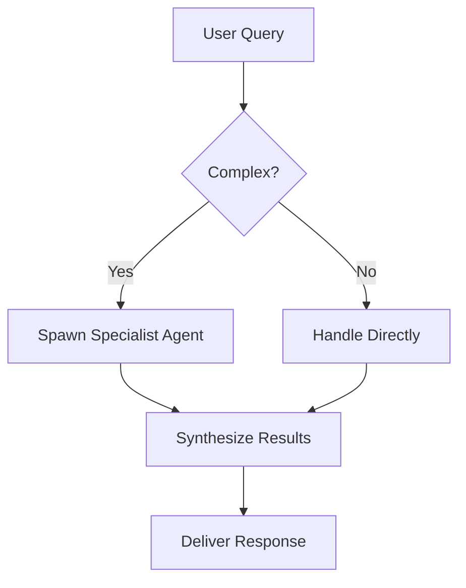

# ZEN Visualization Capabilities Guide

## Overview

ZEN's chat window supports **10 rich visualization formats** that render interactive widgets directly in the chat stream. Use these proactively to enhance user understanding.

---

## 1. Interactive Charts (Chart.js)

**Trigger:** Code blocks with ` ```chart ` language

**Supported Types:**
- `line` - Trends over time
- `bar` - Category comparisons
- `pie` - Proportions (≤6 segments)
- `radar` - Multi-variable comparison
- `doughnut` - Part-to-whole with center space
- `polarArea` - Radial proportions

**Format:**
```chart
{
  "type": "bar",
  "data": {
    "labels": ["Q1", "Q2", "Q3", "Q4"],
    "datasets": [{
      "label": "Revenue",
      "data": [400, 600, 450, 700],
      "backgroundColor": "rgba(0, 255, 159, 0.2)",
      "borderColor": "#00FF9F"
    }]
  }
}
```

**When to Use:**
- Performance metrics → line charts
- Comparison data → bar charts
- Market share → pie charts
- Multi-factor analysis → radar charts

---

## 2. Web Search Intelligence Cards

**Trigger:** Automatic when `web_search` tool is called

**Features:**
- Clickable titles with external link icons
- Source badges (TAVILY, EXA, BRAVE, DDG, WIKI) with color coding
- Relevance score bars (0-100%)
- Expandable full content sections
- Map preview button for location-based results

**Example Output:**
```
┌─────────────────────────────────────────┐
│ 🌐 WEB INTELLIGENCE / "Rust async"     │
│ 12 SOURCES                              │
├─────────────────────────────────────────┤
│ [TAVILY]                    ████████░░ 85% │
│ Async Rust Best Practices 2026         │
│ https://rust-lang.org/async            │
│ Comprehensive guide for async patterns │
│ [MAP PREVIEW]                          │
└─────────────────────────────────────────┘
```

---

## 3. Progress Indicators

**Trigger:** Automatic for multi-step tool executions

**Display:**
```
┌─────────────────────────────────────────┐
│ 🔧 ZEN calling web_search ⏳           │
│ ████████████░░░░░░░░░░░░░░░ 45%        │
└─────────────────────────────────────────┘
```

**Features:**
- Neon green progress bar with glow effect
- Percentage display
- Spinner icon during execution
- Duration display on completion (e.g., "234ms")

---

## 4. Clarification Widgets

**Trigger:** When agent needs bounded user input

**Types:**

### Single Select
```
┌─────────────────────────────────────────┐
│ SELECT ANALYSIS TYPE                    │
│ ○ Military Aircraft Tracking            │
│ ○ Civilian Flight Data                  │
│ ○ Weather Patterns                      │
│ ○ Satellite Positions                   │
│            [CONFIRM]                    │
└─────────────────────────────────────────┘
```

### Multi Select
```
┌─────────────────────────────────────────┐
│ SELECT DATA SOURCES                     │
│ ☑ Tavily Web Search                     │
│ ☐ Exa AI                                │
│ ☑ DuckDuckGo                            │
│ ☐ Wikipedia                             │
│            [CONFIRM]                    │
└─────────────────────────────────────────┘
```

### Rank Priorities
```
┌─────────────────────────────────────────┐
│ PRIORITIZE TASKS (drag to reorder)     │
│ ≡ [1] Geospatial Analysis               │
│ ≡ [2] Weather Data                      │
│ ≡ [3] Route Planning                    │
│            [CONFIRM]                    │
└─────────────────────────────────────────┘
```

---

## 5. Interactive Steppers

**Trigger:** Code blocks with ` ```stepper ` language

**Format:**
```stepper
{
  "title": "OSINT Analysis Workflow",
  "steps": [
    {
      "title": "Step 1: Define Area of Interest",
      "content": "Specify coordinates or location name for the target area."
    },
    {
      "title": "Step 2: Gather Intelligence",
      "content": "Query multiple data sources for comprehensive coverage."
    },
    {
      "title": "Step 3: Analyze Patterns",
      "content": "Identify trends, anomalies, and correlations."
    },
    {
      "title": "Step 4: Generate Report",
      "content": "Compile findings with citations and confidence levels."
    }
  ]
}
```

**Features:**
- Progress indicators (● ● ○ ○)
- Next/Prev navigation
- Keyboard support (arrow keys)
- Markdown content support in each step
- Optional images and code blocks per step

---

## 6. Code Execution Terminals

**Trigger:** Automatic for code blocks with execution output

**Features:**
- Syntax highlighting for 10+ languages (Python, Rust, TypeScript, etc.)
- Copy button
- Save button (downloads as file)
- Word wrap toggle
- Line numbers
- Error highlighting (red background)
- Execution time display
- Exit code display

---

## 7. Mermaid Diagrams

**Trigger:** Code blocks with ` ```mermaid ` language

**Supported Diagrams:**
- Flowcharts (`graph TD`)
- Sequence diagrams (`sequenceDiagram`)
- Class diagrams (`classDiagram`)
- ER diagrams (`erDiagram`)
- Gantt charts (`gantt`)

**Example:**


---

## 8. Geographic Maps

**Trigger:** Code blocks with ` ```map ` language or coordinate arrays

**Format:**
```map
[51.5074, -0.1278]
```

**Features:**
- Interactive Leaflet maps
- Zoom/pan controls
- Marker with popup
- Dark mode tile layer
- Click to open in full tactical map

---

## 9. JSON Data Matrices

**Trigger:** Code blocks with ` ```json ` language (auto-detected)

**Features:**
- Collapsible/expandable sections
- Syntax highlighting
- Copy button
- Type indicators (string, number, boolean)
- Array length indicators

---

## 10. Diff/Patch Views

**Trigger:** Code blocks with ` ```diff ` language

**Format:**
```diff
--- a/src/main.rs
+++ b/src/main.rs
@@ -1,5 +1,6 @@
 fn main() {
-    println!("Hello");
+    println!("Hello, World!");
+    println!("Welcome to ZEN");
 }
```

**Features:**
- Green background for additions (+)
- Red background for deletions (-)
- Line numbers
- Copy button

---

## Visualization Selection Guide

| Data Type | Recommended Format | Example Use Case |
|-----------|-------------------|------------------|
| Time series | `chart` (line) | Stock prices, temperature trends |
| Comparisons | `chart` (bar) | Model performance, revenue by quarter |
| Proportions | `chart` (pie) | Market share, survey results |
| Multi-variable | `chart` (radar) | Skill comparison, feature matrix |
| Processes | `stepper` or `mermaid` | Workflows, algorithms |
| Locations | `map` | Coordinates, routes, areas |
| Code | Syntax-highlighted blocks | Snippets, configurations |
| Search results | Auto-rendered cards | Research, OSINT gathering |
| Complex data | `json` matrix | API responses, configs |
| Changes | `diff` | Code reviews, version comparisons |

---

## Best Practices

1. **Visualize First** - If data can be charted, chart it
2. **Label Completely** - Include units, timestamps, sources
3. **Round Appropriately** - 2-3 significant figures for readability
4. **Provide Context** - Explain what the visualization shows
5. **Enable Exploration** - Let users expand, filter, drill down
6. **Maintain Theme** - All widgets follow eDEX-UI cyberpunk aesthetic
7. **Use Color Purposefully** - Neon green for primary, other colors for distinction
8. **Respect Token Budget** - Don't over-visualize simple data

---

## Accessibility Notes

- All color-coded elements include text labels
- Charts have descriptive titles
- Interactive elements have hover states
- Keyboard navigation supported for steppers
- High contrast mode compatible

---

## Implementation Status

| Feature | Frontend | Backend | Status |
|---------|----------|---------|--------|
| Charts | ✅ | ✅ | Complete |
| Search Cards | ✅ | ✅ | Complete |
| Progress Bars | ✅ | ✅ | Complete |
| Clarification | ✅ | ✅ | Complete |
| Steppers | ✅ | ⏳ | Frontend Ready |
| Code Execution | ✅ | ✅ | Complete |
| Mermaid | ✅ | ✅ | Complete |
| Maps | ✅ | ✅ | Complete |
| JSON Matrix | ✅ | ✅ | Complete |
| Diffs | ✅ | ✅ | Complete |

---

*Last Updated: March 29, 2026*
*Version: 1.0*
